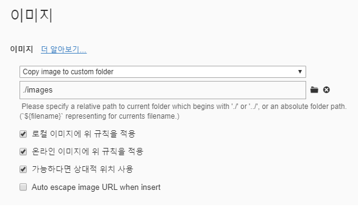

# 마크다운 문법

## 1. 제목(heading)

제목은 `#` 으로 표현 가능하다.  제목의 레벨은 `#`의 갯수로 나타내는데, 1~6단계 까지 표현 가능하다.

### 제목3

#### 제목4

##### 제목5

###### 제목6

## 2. 목록

목록은 순서가 있는 목록과 순서가 없는 목록으로 구분된다.

1. 순서가 있는 목록 (1.) 으로 시작합니다

2. 순서가 있습니다.

   1. tab을 통해 단계를 표현할 수 있습니다.
   2. 아시겠어요?

   엔터

3. 엔터를 누르면 한단계씩 나와서 탈출할 수 있습니다.

* 순서가 없는 목록 (*)키로 시작합니다.

  * tab을 통해 단계를 표현할 수 있습니다.

  마찬가지로 엔터키 또한 사용 가능합니다.

* 엔터

* 아시겠어요?

## 3. 코드 블록

인라인 코드 블록과 전체 코드 블록이 있으며, 전체 코드 블록은 언어에 따른 syntax highlighting 기능을 대부분 지원한다.

`inline` 

(```이후 문법 종류 입력 ex. python)

```python
print('hello')
#파이썬 주석
def foo(a):
    return a
```


```javascript
# 파이썬에서는  # 주석
// 자바스크립트 // 주석
```


## 4. 링크

링크는 대괄호에 이름, 소괄호에 URL

[구글](https://google.com)

## 5. 인용문

> 인용문을 작성할 수 있습니다.

(> 이후 문구 작성)

## 6. 표

typora 기능을 사용합시다. 문법으로 사용하기 귀찮습니다. 대충 타협하세요

| 순번 | 이름   |
| ---- | ------ |
| 1    | 홍길동 |
| 2    | 박윤수 |

## 7. 이미지

이미지도 typora 기능을 사용합시다.

드래그 앤 드랍으로 이미지삽입 가능합니다. 


위의 이미지는 절대 경로(c드라이브)로 작성되어 있기 때문에, 외부(github)에 공개하면 이미지가 깨져서 보인다.

따라서, 다음과 같이 typora 설정을 하자.

* 파일 > 환경설정 > `이미지` 탭 클릭 > 아래 내용 진행
* 진행 후 이미지부터 마크다운 파일 위치를 기준으로 images 폴더를 생성하여 이미지를 복사함.



## 8. 기타 문법

수직선

---

**굵게(볼드체)**

*기울임체(이탤릭체)*

~~취소선~~


